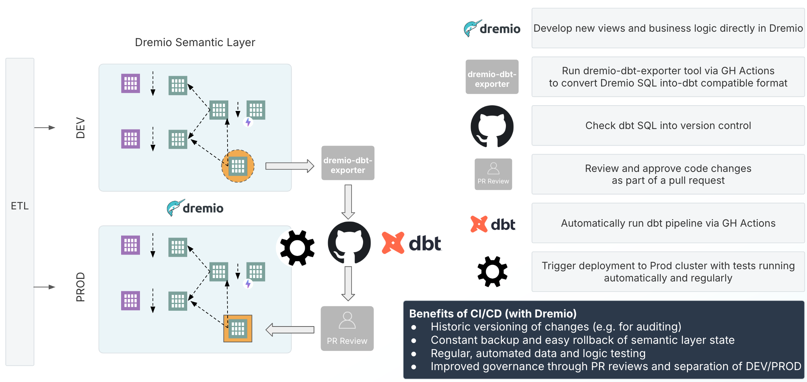

# dremio-dbt-cicd

## Example CI/CD workflow using Dremio and dbt

## Features of this CI/CD workflow
1. Automatically import and version Dremio objects (views, etc.) from your DEV environment into git, using [dremio-dbt-exporter](https://github.com/dremio-professional-services/dremio-dbt-exporter), triggered as a [GitHub Actions](https://docs.github.com/de/actions/about-github-actions/understanding-github-actions) workflow (CI)
2. Review and approve your SQL code changes via [GitHub Pull Requests](https://docs.github.com/en/pull-requests/collaborating-with-pull-requests/reviewing-changes-in-pull-requests/about-pull-request-reviews)
3. Deploy updated Dremio objects to your PROD environment using the power of [dbt](https://docs.getdbt.com/) and the [dbt-dremio](https://github.com/dremio/dbt-dremio) connector, triggered as a GitHub Actions workflow (CD)

## Requirements
- See: [dremio-dbt-exporter Requirements for SOURCE environment](https://github.com/dremio-professional-services/dremio-dbt-exporter?tab=readme-ov-file#requirements)
- In addition to the SOURCE environment privileges, sufficient `ALTER` and `SELECT` privileges on the relevant scopes in the TARGET environment are required
- "Read and write permissions" and "Allow GitHub Actions to create and approve pull requests" for [GitHub Actions Workflow](https://docs.github.com/en/repositories/managing-your-repositorys-settings-and-features/enabling-features-for-your-repository/managing-github-actions-settings-for-a-repository#enabling-workflows-for-private-repository-forks) (-> Settings -> General -> Workflow permissions)

## Github Actions Variables and Secrets
- `GH_PR_REVIEWER` (Variable)        -> see: `-r, --reviewer <handle>` [GH CLI Docs](https://cli.github.com/manual/gh_pr_create)
- `DREMIO_SOURCE_ENV_URL` (Variable)     -> incl. `https://` and port number
- `DREMIO_TARGET_ENV_HOST` (Variable)    -> excl. `https://` and port number
- `DREMIO_USER` (Variable)
- `DREMIO_SOURCE_ENV_PAT` (Secret)       -> [Dremio Docs](https://docs.dremio.com/current/security/authentication/personal-access-tokens/#enabling-the-use-of-pats)
- `DREMIO_TARGET_ENV_PAT` (Secret)

## How to run
1. Specify the Dremio Space (and Source) to be exported as a dbt model via the `export_filter.json` file
2. In GitHub, under "Actions", select the workflow "STEP 1 - Run Dremio dbt export to git" and click "Run workflow"
3. Once the workflow job ran successfully, a new PR should be created under "Pull requests", if any changes to the models in `dbt_out_dir` were detected
4. This PR must be reviewed and approved before it gets merged into the `main` branch. New jobs will fail until the PR has been closed to avoid merge conflicts.
5. Under "Actions", select the workflow "STEP 2 - Run dbt to Dremio" and click "Run workflow"